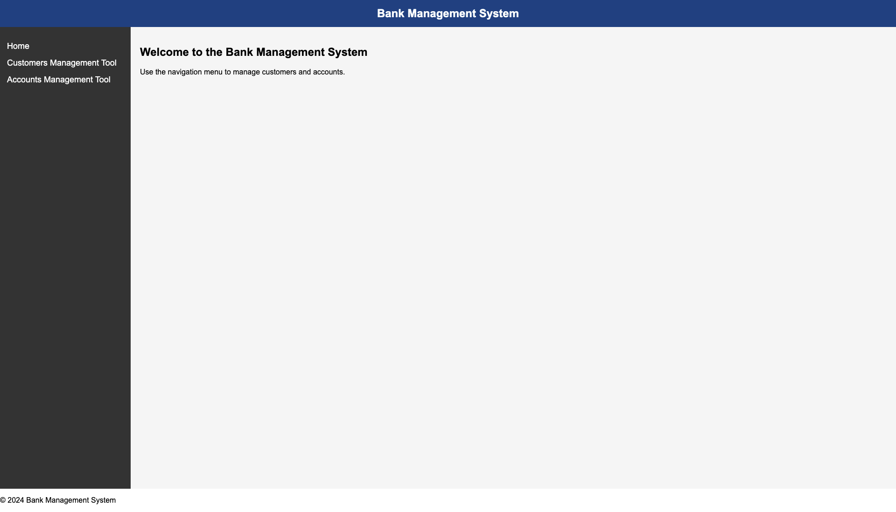
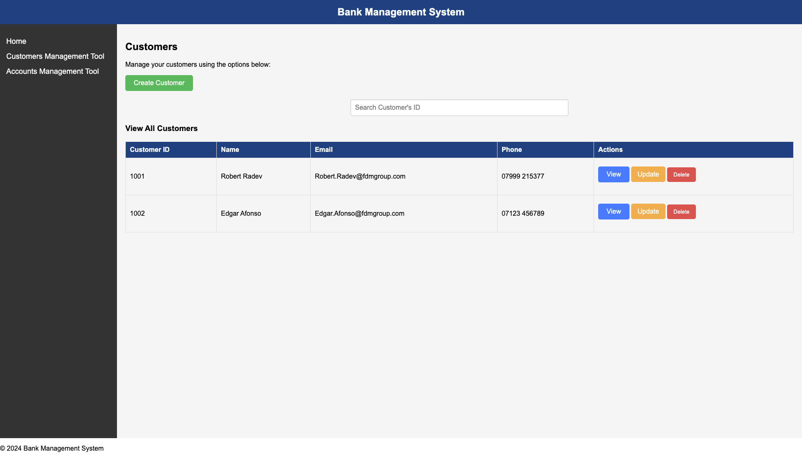
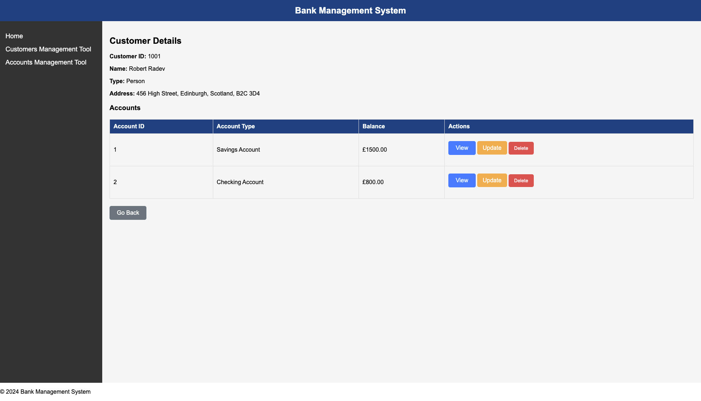
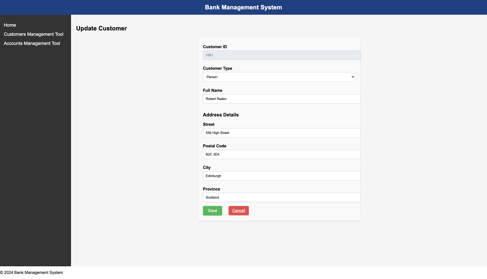
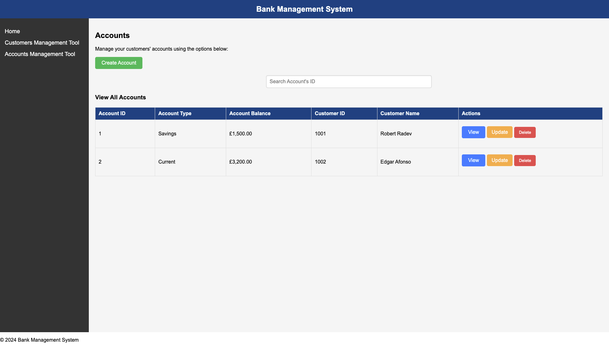
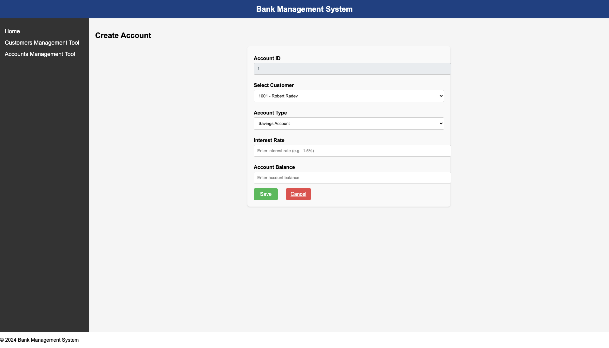
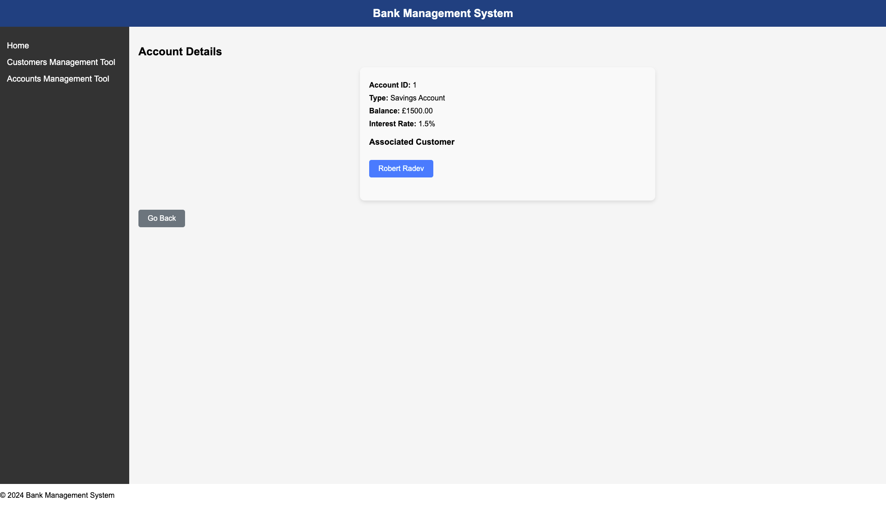

# README.md

# Bank Management System - Customer and Account Management

This project is a web application designed for efficient customer and account management in a bank. It is built using React.js for the front-end and Java Spring Boot for the back-end. The application provides a user-friendly interface for bank tellers to create, view, update, and manage customers and accounts seamlessly.

## Installation and how to run

This project requires you to run both the back-end and front-end at the same time so you can interact with the application.

#### Back-end

1. Clone the Spring Boot repository.
2. Run the application (Sprint-3-Project-Part-2.java) using an IDE or command line.
3. Access the H2 database at [Localhost Port 8080](http://localhost:8080/h2-console).

#### Front-end

1. Clone the React repository.
2. Import the application (sprint-4-project-part-2) in your IDE or navigate to the folder in command line and run it from there:

```bash
code .
```

2. Install dependencies:

```bash
npm install.
```

3. Run the React application:

```bash
npm run dev
```

4. Access the frontend at [Localhost Port 5173](http://localhost:5173).

## Features

### 1. Customer Management

- Create new customers.
- View customer details.
- Update customer information.
- List all customers.
- Account Management

### 2. Create new accounts (Savings or Checking).

- View account details.
- Update account information.
- List all accounts.

### 3. Responsive Design

- Ensures usability across devices.
- Consistent header, sidebar, and footer for easy navigation.

### 4. REST API Integration

- Dynamic data loading from the backend.
- Utilises Axios for API requests.

## Pages Overview

### 1. Index.jsx

- Acts as the homepage of the application.
- Provides an overview and navigation links to both customer and account management tools.



### 2. CustomersList.jsx

- Displays a table of all customers.
- Includes a search bar to filter customers by ID.
- Provides actions to view, update, or delete individual customer records.



### 3. CreateCustomer.jsx

- Form for creating new customer entries.
- Dynamically sends customer data to the backend via a POST request.


### 4. ViewCustomer.jsx

- Displays detailed information for a selected customer.
- Fetches data from the backend based on the customer ID in the URL.



### 5. UpdateCustomer.jsx

- Form for updating existing customer details.
- Pre-fills current data and allows modifications.



### 6. AccountsList.jsx

- Displays a list of all accounts.
- Includes a search bar to filter accounts by ID.
- Provides actions to view, update, or delete accounts.



### 7. CreateAccount.jsx

- Form for creating new accounts (Savings or Checking).
- Includes a dropdown to select the associated customer and account type.
- Sends data dynamically to the backend.



### 8. ViewAccount.jsx

- Displays detailed information for a selected account.
- Fetches data based on the account ID from the URL.



### 9. UpdateAccount.jsx

- Form for updating existing account details.
- Pre-fills current data and allows updates.


## Technologies Used

### Front-End

- React.js
- Axios for API communication
- React Router for navigation
- CSS for styling

### Back-End

- Spring Boot
- H2 Database for in-memory data storage
- RESTful API

## Future Enhancements

- Add validation for customer and account forms.
- Implement role-based authentication for users.
- Enhance the UI for better accessibility and aesthetics.
